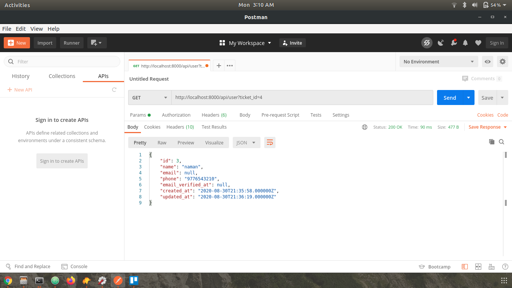
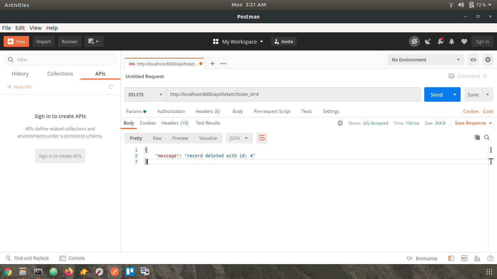

# Ticket Booking System

# Getting started

## Installation

Please check the official laravel installation guide for server requirements before you start. [Official Documentation](https://laravel.com/docs/7.x/installation#installing-laravel)


**TL;DR command list**

    git clone git@github.com:namanvashistha/ticket-booking-system.git
    cd ticket-booking-system
    composer install
    cp .env.example .env
    php artisan key:generate
    php artisan jwt:generate
    php artisan migrate
    php artisan serve

## Environment variables

- `.env` - Environment variables can be set in this file

***Note*** : You can quickly set the database information and other variables in this file and have the application fully working.


----------


# Code overview

## Files

- `app` - Contains all the Eloquent models
- `app/Http/Controllers/TicketController.php` - Contains all the api controllers for tickets
- `database/migrations` - Contains all the database migrations
- `routes/api.php` - Contains all the api routes defined in api.php file


# Testing API

Run the laravel development server

    php artisan serve

The api can now be accessed at

    http://localhost:8000/api


## Endpoints:


### Create Ticket

`POST http://localhost:8000/api/tickets?name=naman&phone=9776543210&timing=20-08-30%2012:00`


```JSON
    {
        "message": "ticket record created",
        "ticket": {
            "title": null,
            "timing": "20-08-30 12:00",
            "expiry": "2020-08-30 20:00:00",
            "user_id": 3,
            "updated_at": "2020-08-30T21:51:18.000000Z",
            "created_at": "2020-08-30T21:51:18.000000Z",
            "id": 7
        },
        "user": {
            "id": 3,
            "name": "naman",
            "email": null,
            "phone": "9776543210",
            "email_verified_at": null,
            "created_at": "2020-08-30T21:35:58.000000Z",
            "updated_at": "2020-08-30T21:36:19.000000Z"
        }
    }
```


### View tickets of a particular timing

`GET http://localhost:8000/api/tickets?timing=2020-08-30%12:00`

```JSON
    [
        {
            "id": 2,
            "title": null,
            "timing": "2020-08-30 12:00:00",
            "expiry": "2020-08-30 20:00:00",
            "user_id": 2,
            "status": "1",
            "created_at": "2020-08-30T21:35:45.000000Z",
            "updated_at": "2020-08-30T21:35:45.000000Z"
        },
        {
            "id": 3,
            "title": null,
            "timing": "2020-08-30 12:00:00",
            "expiry": "2020-08-30 20:00:00",
            "user_id": 3,
            "status": "1",
            "created_at": "2020-08-30T21:35:58.000000Z",
            "updated_at": "2020-08-30T21:35:58.000000Z"
        }
    ]
```


 ### View the user’s details based on the ticket id
`GET http://localhost:8000/api/user?ticket_id=4`

```JSON
     {
        "id": 3,
        "name": "naman",
        "email": null,
        "phone": "9776543210",
        "email_verified_at": null,
        "created_at": "2020-08-30T21:35:58.000000Z",
        "updated_at": "2020-08-30T21:36:19.000000Z"
      }
```




### Update ticket timing
`PUT http://localhost:8000/api/tickets?ticket_id=1&timing=2020-08-30%03:00`

```JSON
    {
    "message": "records updated successfully",
        "ticket": {
            "id": 1,
            "title": null,
            "timing": "2020-08-30 03:00",
            "expiry": "2026-08-18 20:01:00",
            "user_id": 1,
            "status": "1",
            "created_at": "2020-08-30T21:32:11.000000Z",
            "updated_at": "2020-08-30T21:45:49.000000Z"
        }
    }
```


### Delete Ticket
`DELETE http://localhost:8000/api/tickets?ticket_id=4`

```JSON
    {
        "message": "record deleted with id: 4"
    }
```


